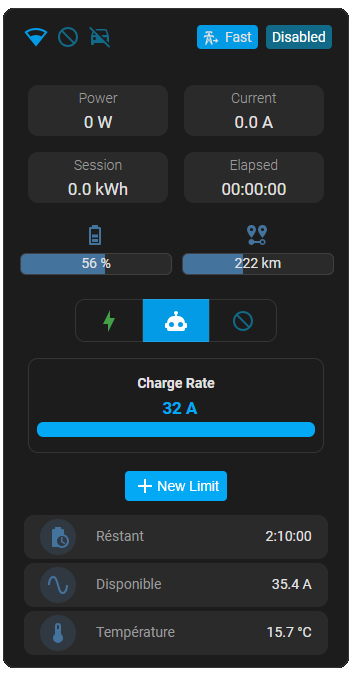
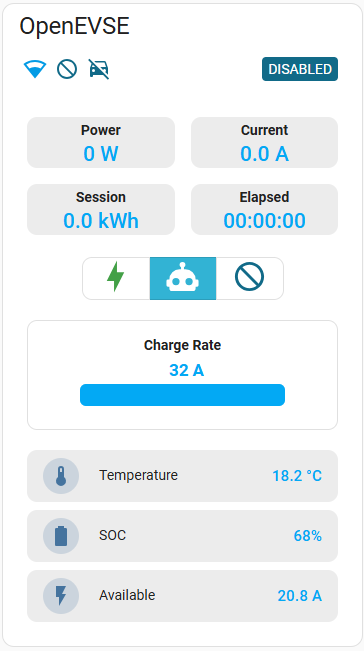
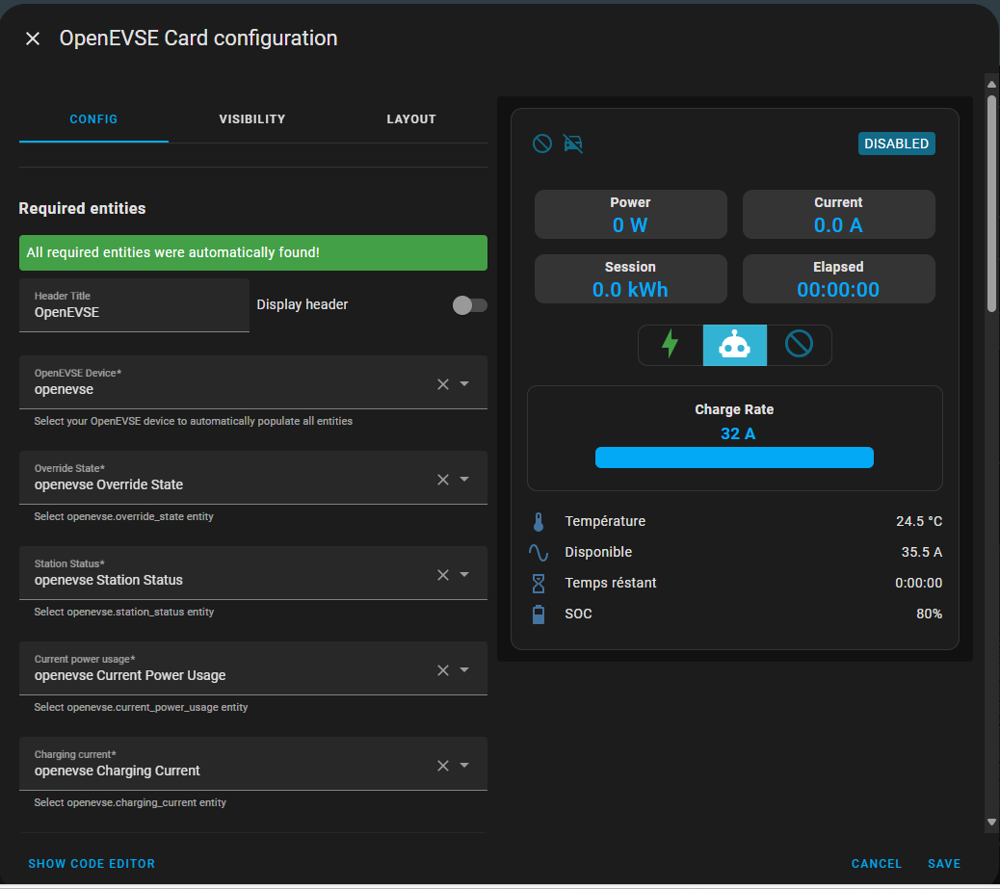

# OpenEVSE card for Home Assistant




This is a Lovelace custom card for @firstof9 [OpenEVSE integration](https://github.com/firstof9/openevse)

## Installation

First install and setup **beta** release of [OpenEVSE Ha integration](https://github.com/firstof9/openevse) using HACS or manually as documented.

Then follow the guide below

### HACS (recommended)


[](https://my.home-assistant.io/redirect/hacs_repository/?owner=KipK&repository=openevse-card&category=plugin)


1. Follow the link [here](https://hacs.xyz/docs/faq/custom_repositories/)
2. Use the custom repo link https://github.com/KipK/openevse-card
3. Select the category type `lovelace`
4. Then once it's there (still in HACS) click the INSTALL button
5. Restart Home Assistant


### Manual install

Add openevse-card.js from dist directory to /local/community/openevse-card/openevse-card.js in HA.
Then add ressource from UI ( upper right pencil icon, then 3 dots menu ) :
"/local/community/openevse-card/openevse-card.js"
Javascript module

## Configuration

Configure it with the card configurator


## Build

install requirements:

```bash
npm install
```

build:

```bash
npm run build
```
