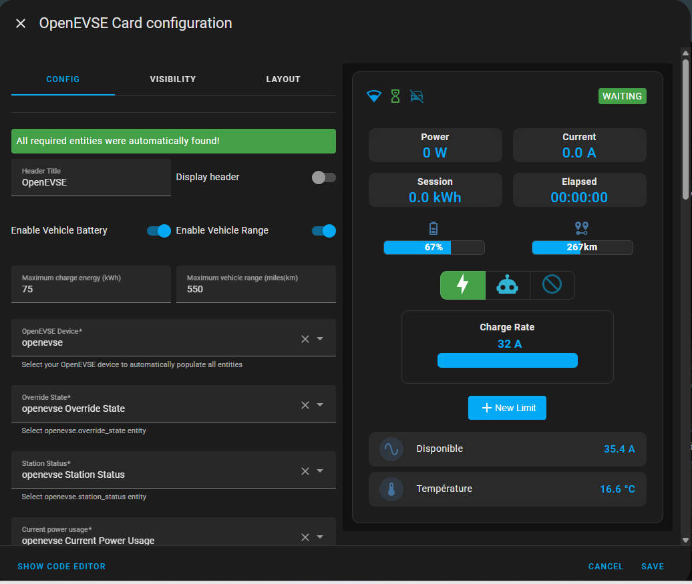

# OpenEVSE card for Home Assistant


This is a Lovelace custom card for @firstof9 [OpenEVSE integration](https://github.com/firstof9/openevse)

## Requirements

[Openevse WiFi firmware](https://github.com/OpenEVSE/openevse_esp32_firmware/) >= 5.0

[OpenEVSE integration](https://github.com/firstof9/openevse) >= 2.1.47

## Installation

If not done, install [OpenEVSE Ha integration](https://github.com/firstof9/openevse) using HACS or manually as documented.

Then install the custom card

### HACS

Search for Openevse card in HACS and install it.

### Manual install

Add openevse-card.js from dist directory to /local/community/openevse-card/openevse-card.js in HA.
Then add ressource from UI ( upper right pencil icon, then 3 dots menu ) :
"/local/community/openevse-card/openevse-card.js"
Javascript module

## Configuration

Configure it with the card configurator.
Select your OpenEVSE device, it should fill-up automatically the required entities.
Additional entities can be added as needed.



## Build

install requirements:

```bash
npm install
```

build:

```bash
npm run build
```
