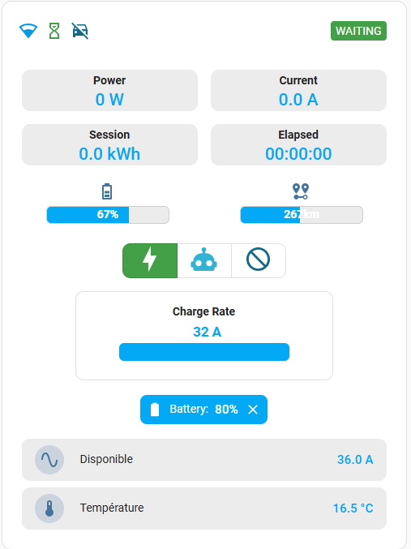

# OpenEVSE card for Home Assistant




This is a Lovelace custom card for @firstof9 [OpenEVSE integration](https://github.com/firstof9/openevse)

## Installation

### HACS (recommended)

Add this url to HACS repositories:
https://github.com/KipK/openevse-card

[](https://my.home-assistant.io/redirect/hacs_repository/?owner=KipK&repository=openevse-card&category=dashboard)

Install "OpenEvse custom card" from hacs

### Manual install

Add openevse-card.js from dist directory to /local/community/openevse-card/openevse-card.js in HA.
Then add ressource from UI ( upper right pencil icon, then 3 dots menu ) :
"/local/community/openevse-card/openevse-card.js"
Javascript module

## Build

install requirements:

```bash
npm -i
```

build:

```bash
npm run build
```
